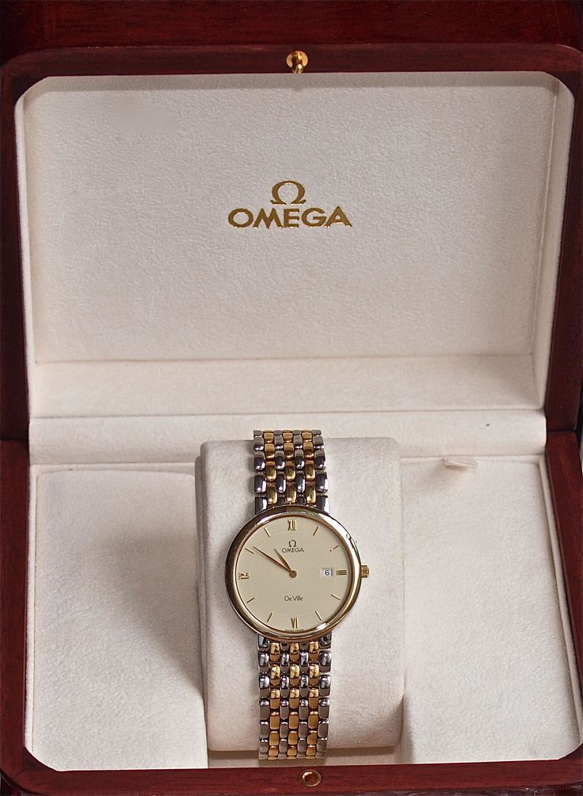

# Product_card
## Date: 9/7/25
## Objective:

To replicate a product card layout similar to those found on real-time e-commerce platform like FlipKart using the CSS Box Model (margin, border, padding, and content).

## Tasks:

#### 1. Structure the HTML Layout:
Create a container ```<div>``` for the product card.

Add an `````` for the product image.

Include ```<h2>``` for product name, ```<p>``` for description, and a ```<span>``` or ```<div>``` for price.

Add a “Buy Now” or “Add to Cart” button.

#### 2. Apply Box Model Styling in CSS:
Use padding inside each section (image, text, button) to ensure readability.

Use margin around the card to space it from the page edges or other cards.

Add a border to outline the card.

Control width and height for consistent sizing.

#### 3. Visual Styling:
Add a background color to the card container.

Use box-shadow to simulate depth (card lifting effect).

Add border-radius for rounded corners.

#### 4. Center the Card:
Use display: flex and justify-content: center and align-items: center on the parent container.

#### 5. Bonus Enhancements:
Use a hover effect on the button (e.g., background color change).

Make the card responsive with percentage-based widths or media queries.
## HTML Code:
```
<!DOCTYPE html>
<html lang="en">
<head>
  <meta charset="UTF-8">
  <title>Product Cards</title>
  <link rel="stylesheet" href="style.css">
</head>
<body>

  <h1 class="heading">Watches Collection</h1>

  <div class="container">
    <div class="card">
      
      <h2>FOSSIL</h2>
      <p>Women's Smart Watch</p>
      <h3>₹461 <span>₹3,499</span></h3>
    </div>

    <div class="card">
      
      <h2>MICHAEL KORS</h2>
      <p>Day & Date Analog Watch</p>
      <h3>₹295 <span>₹1,999</span></h3>
    </div>

    <div class="card">
      
      <h2>OMEGA</h2>
      <p>Mesh Strap Dial Watch</p>
      <h3>₹238 <span>₹999</span></h3>
    </div>

    <div class="card">
      
      <h2>RHINESTONE</h2>
      <p>Slim Case Analog Watch</p>
      <h3>₹401 <span>₹2,499</span></h3>
    </div>
  </div>

</body>
</html>

```
## CSS Code:
```
body {
  margin: 0;
  font-family: Arial, sans-serif;
  background-color: #f2f2f2;
}

.heading {
  text-align: center;
  padding: 20px;
  background-color: goldenrod;
  color: white;
  margin-bottom: 20px;
}

.container {
  display: flex;
  justify-content: center;
  flex-wrap: wrap;
  gap: 20px;
  padding: 20px;
}

.card {
  background-color: white;
  border: 1px solid #ddd;
  border-radius: 10px;
  width: 200px;
  padding: 15px;
  box-shadow: 0 2px 5px rgba(0,0,0,0.1);
  text-align: center;
  transition: transform 0.2s;
}

.card:hover {
  transform: scale(1.03);
}

.card img {
  width: 100%;
  height: auto;
  border-radius: 5px;
}

.card h2 {
  font-size: 16px;
  margin: 10px 0 5px;
}

.card p {
  font-size: 14px;
  color: #555;
}

.card h3 {
  color: green;
  font-size: 16px;
}

.card h3 span {
  color: #999;
  text-decoration: line-through;
  font-size: 13px;
  margin-left: 5px;
}

```
## Output:


## Result:
A product card layout similar to those found on real-time e-commerce platform like FlipKart using the CSS Box Model is replicated successfully.
